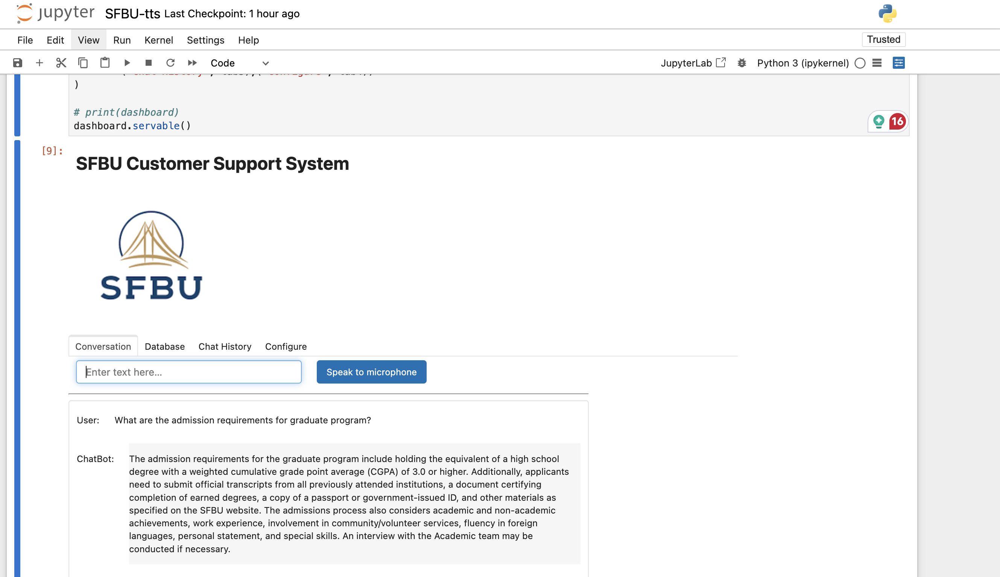
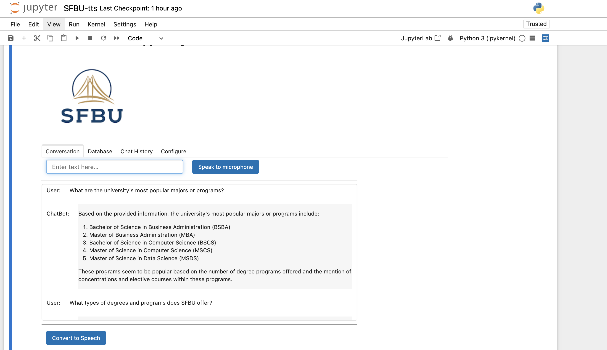
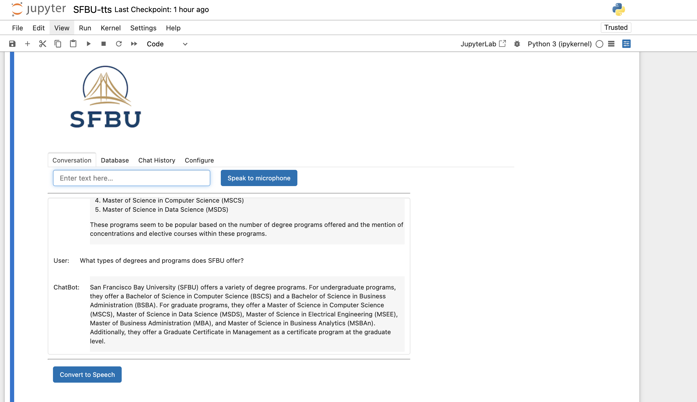

# SFBU Customer Support System - Speech to Text to Speech

## Overview

The **SFBU Customer Support System** is an AI-driven application designed to enhance customer support by integrating real-time Speech-to-Text, Text-to-Speech, and Document Retrieval functionalities. The project leverages OpenAI's Whisper, LangChain, and OpenAI Text-to-Speech to provide an interactive and efficient support experience.

---

## Features

- **Speech-to-Text**: Converts spoken queries into text using OpenAI Whisper.
- **Document Retrieval**: Fetches relevant answers from uploaded PDF documents.
- **Conversational AI**: Utilizes LangChain's Conversational Retrieval Chain for intelligent responses.
- **Text-to-Speech**: Converts responses into audio output using OpenAI's TTS API.
- **Interactive GUI**: A user-friendly dashboard built with Panel for seamless interaction.

---

## Workflow

1. **Document Loading**: Upload and process PDFs for content retrieval.
2. **Chunk Splitting**: Break documents into manageable sections using LangChain splitters.
3. **Vector Database**: Embed and store document chunks for efficient search and retrieval.
4. **Query Processing**: Generate context-aware answers using LangChain and OpenAI.
5. **Text-to-Speech**: Deliver audio responses for enhanced user experience.

---

## Installation

### Prerequisites

- Python 3.8+
- An OpenAI API key
- Install dependencies:

```bash
    pip install -r requirements.txt
```

## Environment Setup

- Clone the repository:

```bash
    git clone https://github.com/JTasnim/SFBUSpeechToTextToSpeech.git
```

- Set up the .env file:
  OPENAI_API_KEY=your_openai_api_key

## Usage

- Launch the application
  python SFBU-tts.ipynb

- Features
  Upload a PDF document in the "Configure" tab.
  Speak into the microphone to ask a question.
  View text responses and listen to audio replies.

## Testing

- Verified transcription accuracy using Whisper.
- Checked document retrieval against multiple query types.
- Validated text-to-speech conversion quality.

## Screenshot of execution results







---

## To learn more

[Google Slide](/assets/SFBU_Customer_SupportSystem_SpeechToTextToSpeech.pptx)
